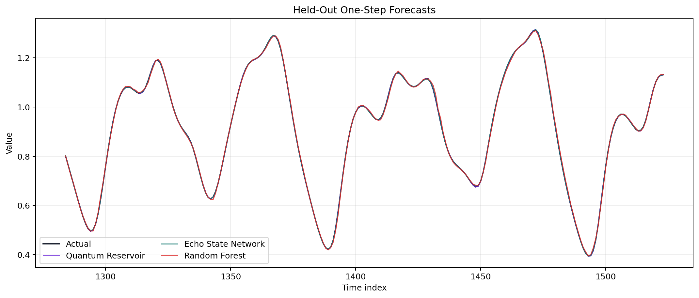
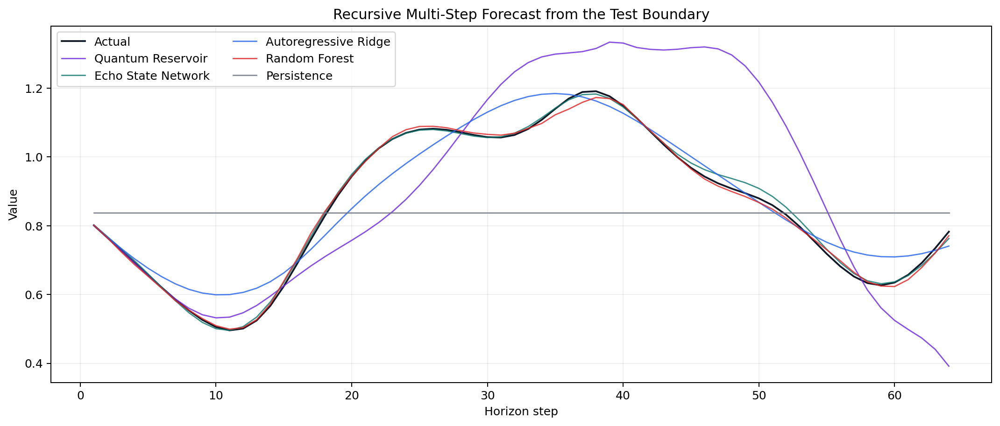
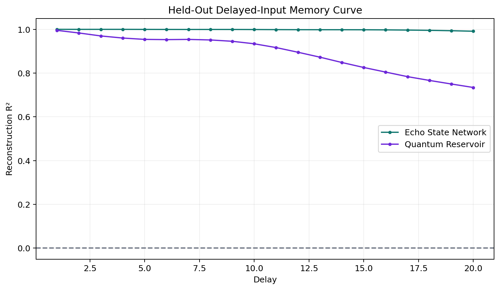
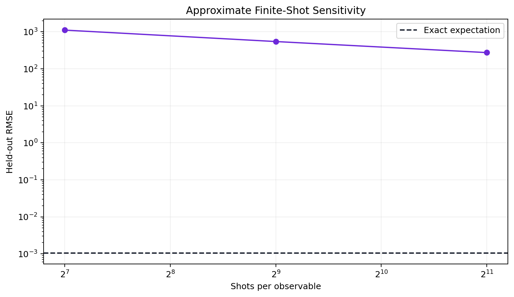

# Quantum Reservoir Computing System

Created by School of AI and School of QC.

Project 8 in the cutting-edge AI and quantum computing project series.

A complete, local-first quantum reservoir computing (QRC) benchmark for nonlinear time-series
prediction. A scalar sequence drives a fixed four-qubit spin reservoir; quantum dynamics convert
recent temporal history into 40 measured features, and only a lightweight classical ridge readout
is trained.

The repository is ready to upload to GitHub. It includes a reusable Python package, command-line
runner, three-workflow Streamlit app, saved-model CSV forecasting, executable notebook,
deterministic Mackey–Glass data, strong classical controls, 88 automated tests, Python 3.11/3.12
CI, model and responsible-use documentation, curated evidence, and an MIT license. Everything
runs with exact local density-matrix simulation. No API key, cloud account, paid service, or
quantum hardware is required.

## Why reservoir computing?

Ordinary recurrent neural networks train internal recurrent weights. Reservoir computing keeps a
complex dynamical system fixed and trains only its output layer. In this project, the dynamical
system is quantum:

1. Scale each input $u_t$ to $[0,1]$.
2. Replace qubit 0 with the mixed input state
   $\rho(u_t)=(1-u_t)|0\rangle\langle0|+u_t|1\rangle\langle1|$.
3. Evolve the full density matrix under a fixed transverse-field Ising Hamiltonian.
4. Record single-qubit $Z_i$ and pairwise $Z_iZ_j$ expectations at four virtual nodes.
5. Fit a ridge readout to predict the next time-series value.

The fixed Hamiltonian is

$$H=\sum_{i<j}J_{ij}X_iX_j+\sum_i h_iZ_i.$$

The seeded $J_{ij}$ couplings and $h_i$ fields never train. The default four-qubit system has a
16-dimensional Hilbert space, ten observables, four virtual nodes, 40 measured features, zero
trained quantum parameters, and 41 trained readout parameters.

~~~mermaid
flowchart TD
    A["Scalar time series"] --> B["Train-only input scaling"]
    B --> C["Reset input qubit"]
    C --> D["Fixed Ising evolution"]
    D --> E["Z and ZZ virtual-node measurements"]
    E --> F["40 temporal features"]
    F --> G["Trained ridge readout"]
    G --> H["One-step and recursive forecasts"]
~~~

## Leakage-safe benchmark

The deterministic Mackey–Glass series is converted to a one-step forecasting task, then split in
time order:

~~~mermaid
flowchart TD
    A["Mackey–Glass sequence"] --> B["Causal lag framing"]
    B --> C["60% train"]
    B --> D["20% validation"]
    B --> E["20% untouched test"]
    C --> F["Fit scaling and model readouts"]
    D --> G["Select ridge regularization"]
    F --> G
    G --> H["Freeze models"]
    E --> H
~~~

No random shuffling is used. Input and target scalers fit the training block only. Validation
selects ridge regularization. Test values do not train the quantum reservoir, classical
reservoir, readouts, scalers, or hyperparameters.

## Classical controls

- **Echo-state network** — fixed classical reservoir with the same 40-dimensional state size.
- **Autoregressive ridge** — a strong linear control with 20 explicit causal lags.
- **Random forest** — a nonlinear tree control using the same 20 lags.
- **Persistence** — predicts that the next value equals the current value.

These controls are intentionally difficult to beat. The lag models receive explicit history,
while QRC and ESN must carry history internally; that information difference is disclosed rather
than presented as a perfectly matched contest.

## Quick start

Python 3.11 or 3.12 is supported.

~~~bash
python -m venv .venv
source .venv/bin/activate
python -m pip install --upgrade pip
python -m pip install -e ".[dev]"
streamlit run app.py
~~~

Run the frozen reference benchmark:

~~~bash
qrc-train --config configs/default.json
~~~

Run a smaller experiment:

~~~bash
qrc-train --samples 600 --qubits 3 --virtual-nodes 2 \
  --washout 20 --lags 10 --rollout-horizon 16
~~~

## Streamlit workbench

The app provides three workflows:

- **Run benchmark** — configure and execute a causal experiment.
- **Inspect saved run** — review metrics, plots, report, and reservoir-step diagram.
- **Forecast CSV** — upload a value history and download recursive forecasts.

## Notebook

[notebooks/quickstart.ipynb](notebooks/quickstart.ipynb) walks through data generation, quantum
dynamics, model comparison, recursive rollout, memory capacity, and saved inference.

To install JupyterLab:

~~~bash
python -m pip install -e ".[notebook]"
jupyter lab notebooks/quickstart.ipynb
~~~

## Forecast a history CSV

The input file needs one finite numeric column named value and at least 20 rows:

~~~bash
python scripts/generate_series.py
qrc-train --config configs/default.json
python scripts/forecast_csv.py artifacts/<run-name> data/mackey_glass.csv \
  --horizon 24 --output future_forecasts.csv
~~~

Saved inference reloads the train-fitted scaler, exact QRC dynamics, frozen linear readout, ESN,
autoregressive ridge, and random forest. Only load joblib artifacts from trusted sources.

## Frozen seed-42 evidence

The default run generated 1,600 time-series points and 1,580 supervised rows: 948 train, 316
validation, and 316 held-out test rows.

One-step held-out RMSE:

- Autoregressive ridge: **0.000495**
- Quantum reservoir: **0.001056**
- Echo-state network: **0.001593**
- Random forest: **0.005204**
- Persistence: **0.034504**

The QRC reached R² **0.999980**, directional accuracy **0.9968**, and RMSE skill **0.9694**
relative to persistence. It beat the size-matched ESN on one-step RMSE but did not beat
autoregressive ridge.

The 64-step recursive rollout tells a different story:

- Random forest RMSE: **0.010024**
- Echo-state network RMSE: **0.011189**
- Autoregressive ridge RMSE: **0.057156**
- Quantum reservoir RMSE: **0.187603**
- Persistence RMSE: **0.211345**

The QRC remains slightly better than persistence but accumulates substantial recursive error.
This distinction between teacher-forced one-step prediction and free-running rollout is a central
lesson of the project.

## Memory and finite-shot diagnostics

Across delays 1–20, positive delayed-input memory capacity was **17.7966** for QRC and **19.9599**
for the ESN. This diagnostic reconstructs past scaled inputs from frozen reservoir features; it
is not a proof of general memory capacity.

The exact-expectation QRC readout is highly sensitive when independent binomial measurement noise
is injected without retraining: RMSE rose from **0.001056** exact to **1113.2532** at 128 shots,
**546.5150** at 512 shots, and **274.5951** at 2,048 shots. This intentionally harsh probe does
not simulate a complete hardware measurement protocol, but it exposes the danger of deploying
an exact-simulator readout unchanged under finite sampling.

## What is genuinely quantum?

Qiskit constructs the fully connected XX plus local Z Hamiltonian and Pauli observables. SciPy
computes the exact substep unitary, and a 16-by-16 density matrix is repeatedly reset, evolved,
and measured. The resulting expectations depend on coherent many-body dynamics.

Classical code still handles data generation, scaling, ridge training, baselines, metrics,
serialization, and visualization. Exact density-matrix simulation becomes exponentially more
expensive with qubit count. This project demonstrates a legitimate QRC algorithm, not quantum
speedup or hardware advantage.

## Generated artifacts

Each timestamped run records:

- configuration, environment, series, causal frame, and split assignments;
- serialized QRC dynamics/readout, scaler, and classical models;
- one-step predictions, recursive rollout, metrics, and alpha search;
- Hamiltonian couplings, local fields, diagnostics, and a circuit visualization;
- reservoir features, memory-capacity curve, and finite-shot sensitivity;
- eleven publication-ready plots and a self-contained Markdown report.

The compact evidence under [examples/reference-run](examples/reference-run) is tracked. Large
generated models, feature matrices, and timestamped runs remain ignored.

## Quality checks

~~~bash
ruff check .
ruff format --check .
pytest
python -m build
~~~

The 88-test suite covers configuration, causal framing, preprocessing, readout selection,
classical controls, independent Qiskit partial-trace and density-evolution parity, unitary and
density invariants, serialization, CLI, app startup, artifact reloads, and recursive inference.

## Repository map

- app.py — interactive benchmark, saved-run inspector, and CSV forecaster
- src/quantum_reservoir_system/ — reusable dynamics, models, evaluation, and artifacts
- notebooks/quickstart.ipynb — guided end-to-end experiment
- configs/default.json — frozen reference configuration
- examples/reference-run/ — curated machine-readable evidence
- scripts/ — series generation and saved-model forecasting
- tests/ — unit, independent parity, integration, CLI, and app tests
- docs/ — mathematics, architecture, results, model card, and safety guidance
- .github/workflows/ci.yml — Python 3.11/3.12 quality gates

## Limitations

The Mackey–Glass series is deterministic and synthetic. Exact simulation omits device noise,
transpilation, calibration drift, queue time, joint measurement grouping, state preparation, and
real execution cost. The finite-shot probe samples each expectation independently and is a
sensitivity analysis, not hardware emulation. The reference result uses one reservoir seed and
one chronological split. Long-horizon forecasts can become unstable.

Do not use this project for financial trading, grid dispatch, medical monitoring, safety control,
or other consequential forecasting without representative data, uncertainty estimates, drift
monitoring, access controls, domain validation, and human oversight.

## Technical references

- Fujii and Nakajima,
  [Harnessing disordered quantum dynamics for machine learning](https://arxiv.org/abs/1602.08159).
- Kutvonen, Fujii, and Sagawa,
  [Optimizing a quantum reservoir computer for time series prediction](https://arxiv.org/abs/1807.03947).
- IBM Quantum,
  [Qiskit quantum-information API](https://quantum.cloud.ibm.com/docs/en/api/qiskit/qiskit.quantum_info).
- IBM Quantum,
  [SparsePauliOp API](https://quantum.cloud.ibm.com/docs/en/api/qiskit/qiskit.quantum_info.SparsePauliOp).

## License and citation

Released under the MIT License. If this project supports teaching or research, cite the included
CITATION.cff and disclose changes to the series generator, time split, reservoir seed,
Hamiltonian, measurements, washout, readout search, or forecast horizon.

Created by School of AI and School of QC.
